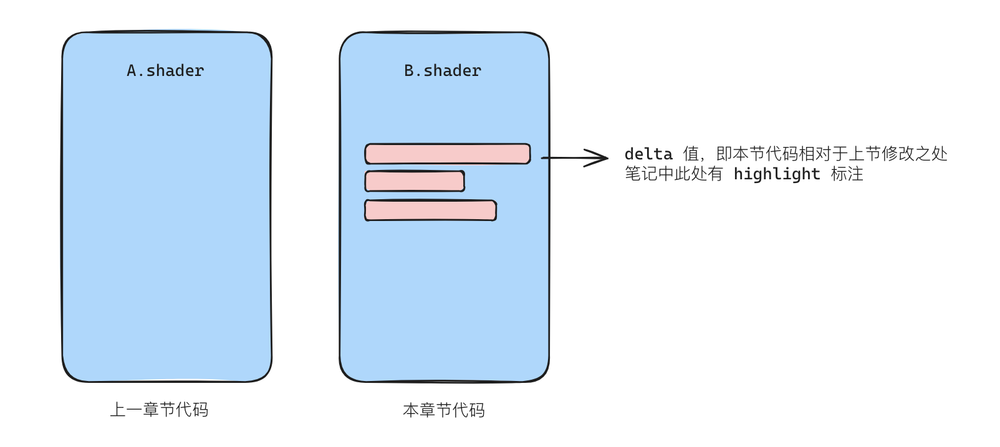

# Introduction
the accompanying code for CatLikeCoding notes

这是 CatlikeCoding - Rendering 部分笔记的配套代码

**笔记 is here: https://dgtototo.gitbook.io/arcade/rendering/introduction**

[正在更新中...]

1. 主要教程为 [CatlikeCoding - Unity -Rendering](https://catlikecoding.com/unity/tutorials/rendering/) 部分。原教程共 20 节，笔记遵循原章节顺序及内容划分。该资源来自[天源](https://www.zhihu.com/people/jiatianyuan)在[技术美术学习大纲](https://zhuanlan.zhihu.com/p/445083991)中的推荐；
2. 笔记并非以翻译为目的。章节内叙述部分因考虑到教程 step by step 的风格略显头绪诸多，故尽可能保留思路的情况下，略有规整与修改。此外在 ChatGPT 的帮助下，添加了部分个人理解与叙述；
3. 每章节 APPENDIX 部分附有该章节代码与 unity package，及 GAMES101 对应理论的索引，后续可能会补充更多参考资料；
4. APPENDIX 部分的 Anki 卡片记录了该章节主要记忆点。卡片使用 Notion 制作，[2anki](https://2anki.net/) 工具转换为 apkg 格式。你可以在[这里](https://dgtototo.notion.site/cc6b312be89d413dba193433d1fc2793?pvs=4)对卡片内容进行预览。需要使用时，打开 Anki，双击下载的 apkg 文件就可以直接导入；
5. 你需要具备的基础：
   a. 基本的图形学理论知识。比如 [GAMES101](https://www.bilibili.com/video/BV1X7411F744/?spm_id_from=333.337.search-card.all.click) / [百人计划](https://learn.u3d.cn/tutorial/technical-artist-may?chapterId=63562b28edca72001f21d0e5)，etc；
   b. 基本基本基本的 Unity 操作知识。比如知道如何将一张图片拖进 Assets 文件夹里；
6. *Don't Panic.* —— The Hitchhiker's Guide to the Galaxy

# How to Use Anki & Code

1. 打开 Anki，其中有要求代码的卡片；

   

2. 根据 pre 字段找到代码（如 A.shader），base on that，将其修改为本节代码（如 B.shader）。如有疑问，查看笔记中本节代码 highlight 字段。

   